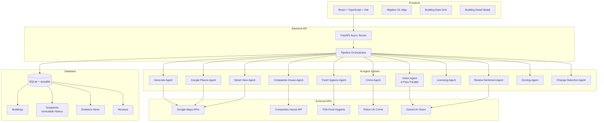
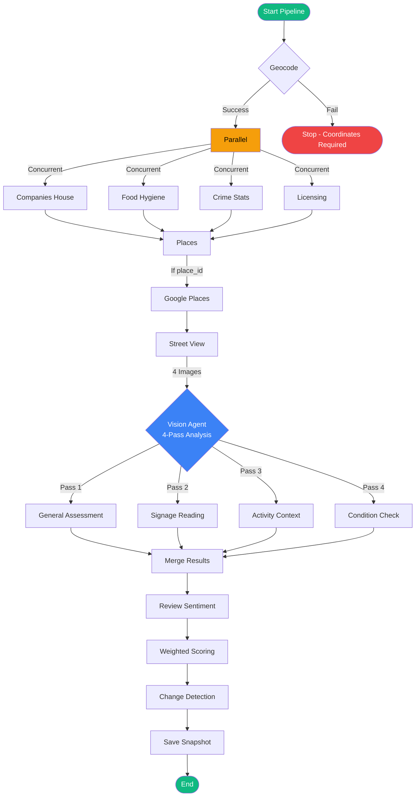

# Lumen

Intelligent property risk assessment for commercial insurance underwriting.

**Live Demo:** [https://lumen-web-781072572686.europe-west2.run.app/](https://lumen-web-781072572686.europe-west2.run.app/)

**Demo Video:** [Watch Lumen in Action](https://github.com/user-attachments/assets/bb2922af-e2c0-432a-93bb-3ec2d64e59b3)

---

## Overview

Lumen is an AI-powered property intelligence platform designed for commercial insurance underwriters. It automates the detection of property misuse, regulatory violations, and risk factors by analyzing building data through computer vision, external APIs, and intelligent scoring algorithms.

### The Problem

Commercial property insurance underwriting relies heavily on manual verification and periodic inspections. Key challenges include:

- **Property Misuse:** Businesses operating outside their registered use class (e.g., a shop converted to late-night venue)
- **Tenant Verification:** Difficulty confirming actual business operations match declared activities
- **Regulatory Compliance:** Tracking food hygiene ratings, licensing, and safety certifications across portfolios
- **Risk Accumulation:** Undetected changes in building use creating liability exposure
- **Resource Intensity:** Physical inspections are costly and time-consuming

### The Solution

Lumen provides automated, continuous property intelligence through an 11-step AI pipeline that analyzes buildings across multiple dimensions:

- **Location Intelligence:** Precise geocoding and spatial context
- **Corporate Data:** UK Companies House registry lookups
- **Visual Analysis:** Street-level imagery processed by Gemini AI
- **Regulatory Monitoring:** Food hygiene ratings, crime statistics, licensing data
- **Risk Scoring:** Weighted evidence algorithm producing 0-100 risk scores
- **Change Detection:** Historical snapshot comparison to identify material changes

---

## Architecture



---

## Pipeline Flow



---

## Risk Scoring Algorithm

Evidence signals are weighted and summed to produce a 0-100 risk score:

| Signal Type | Weight | Description |
|-------------|--------|-------------|
| CV Classification | 40 pts | Vision model detected occupier vs registered use mismatch |
| SIC Mismatch | 25 pts | Companies House SIC codes don't match property class |
| Licensing | 20 pts | Nearby licensed premises or licensing violations |
| Keyword Hit | 15 pts | Risk keywords detected (closure, construction, etc.) |
| Food Hygiene Poor | Variable | FSA rating 0-2 (fail to improvement needed) |
| Crime Commercial | Variable | High/medium commercial crime in area |
| Review Negative | Variable | Closure mentions or negative sentiment trends |

**Risk Tiers:**
- **Low (0-33):** Standard monitoring
- **Medium (34-66):** Enhanced review recommended
- **High (67-85):** Immediate attention required
- **Critical (86-100):** Escalate to senior underwriter

---

## Technology Stack

### Backend
- **Framework:** FastAPI (async Python 3.11)
- **Database:** SQLAlchemy 2.0+ with aiosqlite
- **AI/ML:** Google Gemini for vision and text analysis
- **Data Sources:** Companies House, Google Places, Street View, FSA, Police UK

### Frontend
- **Framework:** React 19 + TypeScript
- **Build Tool:** Vite 8
- **Styling:** Tailwind CSS 3.4
- **Maps:** Mapbox GL JS
- **Animation:** Framer Motion

### Development Tools
- **Backend Package Manager:** uv
- **Frontend Package Manager:** npm
- **Linting:** Ruff (backend), ESLint + typescript-eslint (frontend)
- **Testing:** pytest with asyncio mode

---

## Quick Start

### Prerequisites
- Python 3.11+
- Node.js 18+
- API keys for Google and Companies House

### Environment Setup

1. Clone the repository
2. Copy `.env.example` to `.env` in the project root:
   ```bash
   cp .env.example .env
   ```

3. Configure your `.env` file:
   ```bash
   GOOGLE_API_KEY=your-google-maps-api-key
   GEMINI_API_KEY=your-gemini-api-key  # From https://ai.google.dev/
   COMPANIES_HOUSE_API_KEY=your-companies-house-key
   ```

### Backend Setup

```bash
cd backend

# Install dependencies
uv sync

# Run development server
unset DATABASE_URL  # Important: Use SQLite instead of PostgreSQL
source ../.env
uv run python -m uvicorn app.main:app --reload --port 8000
```

### Frontend Setup

```bash
cd frontend

# Install dependencies
npm install

# Run development server
npm run dev
```

The application will be available at:
- Frontend: http://localhost:5173
- Backend API: http://localhost:8000

---

## Project Structure

```
lumen/
├── backend/
│   ├── app/
│   │   ├── api/           # FastAPI route handlers
│   │   ├── models/        # SQLAlchemy ORM models
│   │   ├── schemas/       # Pydantic response schemas
│   │   ├── services/      # Business logic layer
│   │   ├── config.py      # Environment configuration
│   │   └── main.py        # FastAPI application entry
│   ├── lumen_agents/      # AI agent implementations
│   │   └── agents/
│   │       ├── geocode.py
│   │       ├── vision.py      # 4-pass Gemini analysis
│   │       ├── companies_house.py
│   │       ├── scoring.py
│   │       └── ...
│   └── seed.py            # Database seeding with real businesses
├── frontend/
│   ├── src/
│   │   ├── components/    # React components
│   │   │   ├── MapPanel.tsx
│   │   │   ├── BuildingModal.tsx
│   │   │   └── ...
│   │   ├── hooks/         # Custom React hooks
│   │   ├── api/           # API client functions
│   │   └── App.tsx        # Main application
│   └── vite.config.ts
├── .env                   # API keys (not committed)
└── README.md
```

---

## Key Features

### Interactive Map Visualization
- Real-time building locations with color-coded risk indicators
- Clustering for large portfolios
- Search and fly-to functionality

### Building Risk Dashboard
- Sortable, filterable data grid
- Risk tier badges and status indicators
- Quick search across addresses and tenants

### Detailed Building Modal
- Timeline view of risk signals
- Real-time pipeline execution with visual feedback
- Manual pipeline re-trigger for updated analysis
- Risk score gauge with historical context

### Automated Pipeline
- One-click re-analysis of any building
- Tree-structured execution visualization
- Progress indicators for each agent stage
- Historical snapshots for change tracking

---

## Data Model

### Building
Core property record with tenant information, geolocation, risk classification, and status tracking.

### Snapshot
Immutable record of each pipeline run containing all agent data, scores, and confidence metrics.

### EvidenceItem
Individual risk signals with weighted scores, confidence factors, and source attribution.

### Review
Human underwriter decisions (cleared, escalated, noted) with audit trail.

---

## Development

### Backend Commands
```bash
cd backend

# Install dependencies
uv sync

# Run tests
uv run pytest

# Lint code
uv run ruff check .

# Start development server
uv run python -m uvicorn app.main:app --reload --port 8000
```

### Frontend Commands
```bash
cd frontend

# Install dependencies
npm install

# Start development server
npm run dev

# Build for production
npm run build

# Run linter
npm run lint
```

---

## Deployment

The application is containerized and deployed to Google Cloud Run:

**Production URL:** https://lumen-web-781072572686.europe-west2.run.app/

---

## License

[License information pending]

---

## Acknowledgments

- Google Gemini for vision and text analysis capabilities
- UK Companies House for business registry data
- Police UK and FSA for regulatory data APIs
- Mapbox for mapping infrastructure
