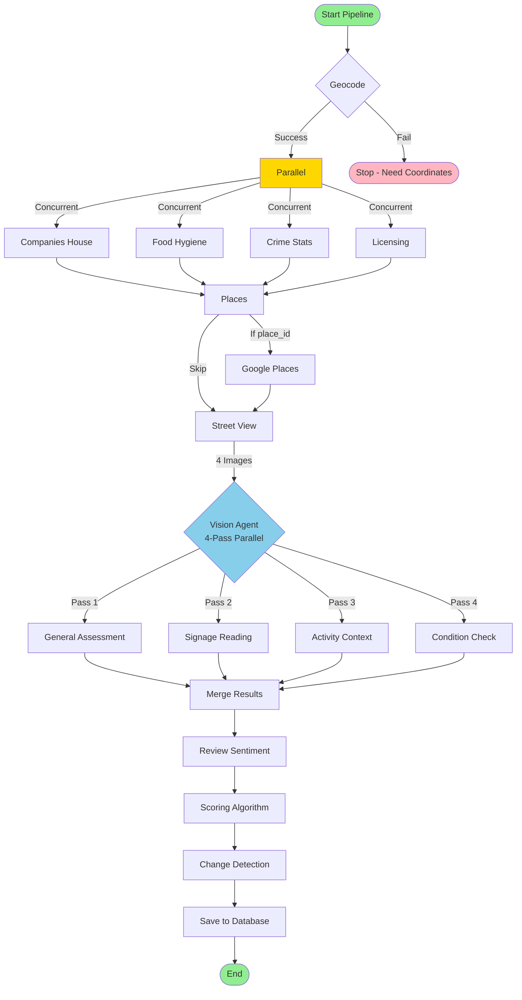

# Pipeline Execution Flow

Step-by-step flow of the 11-step pipeline with parallel processing highlights.

## Execution Flow Details

### Step 1: Geocode (Sequential, Required)
- Converts address to latitude/longitude
- Must succeed or pipeline stops
- Time: ~200ms

### Steps 2-5: Parallel Data Gathering
All 4 agents run simultaneously using `asyncio.gather()`:
- **Companies House**: SIC codes, company status
- **Food Hygiene**: FSA ratings (free API)
- **Crime Stats**: Police UK data (free API)
- **Licensing**: Local license lookup

Time: ~1-2s (parallel vs 4-8s sequential)

### Step 6: Google Places
- Fetches business name, reviews, types
- Requires place_id from geocoding
- Time: ~500ms

### Steps 7-8: Street View + Vision (Sequential)
1. **Street View**: Downloads 4 images (N, E, S, W)
2. **Vision**: 4-pass parallel analysis
   - Pass 1: General assessment
   - Pass 2: Detailed signage
   - Pass 3: Activity & context
   - Pass 4: Building condition

Time: ~3-4s (parallel passes)

### Step 9: Review Sentiment
- Analyzes Google reviews with Gemini
- Detects closure mentions, negative trends
- Time: ~1s

### Step 10: Scoring
- Weights all evidence signals
- Applies confidence multipliers
- Time: ~10ms

### Step 11: Change Detection
- Compares to previous snapshot
- Detects material changes
- Updates building status
- Time: ~10ms

## Performance Optimizations

| Optimization | Benefit |
|-------------|---------|
| **Parallel Steps 2-5** | 4x faster data gathering |
| **Parallel Vision Passes** | 4x faster image analysis |
| **Semaphore (max 5)** | Prevents API rate limits |
| **Flash Models** | 2x faster than Pro |
| **JSON Mode** | Reliable structured output |
