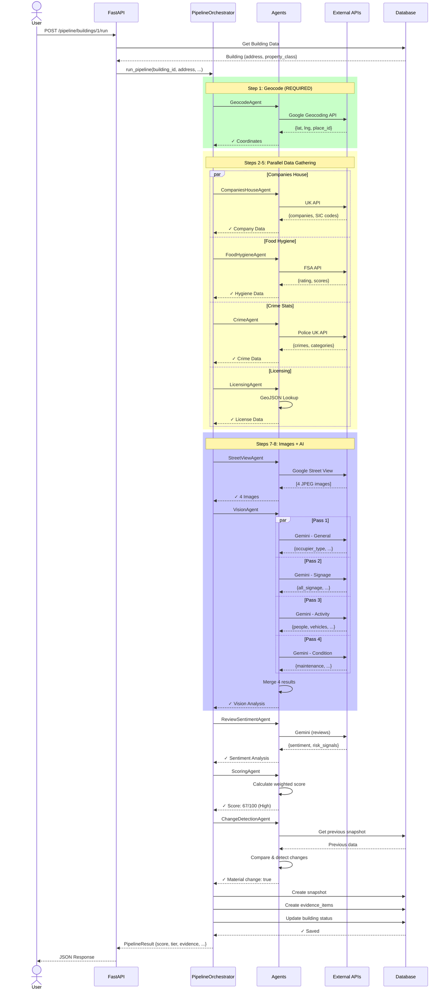

# Data Flow Sequence Diagram

Shows the complete request lifecycle from API call to database persistence.

## Request Lifecycle

1. **User Request**: POST to `/api/pipeline/buildings/{id}/run`
2. **Building Lookup**: Fetch building from database
3. **Pipeline Execution**: 11-step orchestrated workflow
4. **Parallel Processing**: Steps 2-5 and Vision passes run concurrently
5. **External API Calls**: 8 different APIs called
6. **AI Analysis**: Gemini processes images and reviews
7. **Scoring**: Weighted algorithm calculates risk
8. **Persistence**: Results saved to 3 database tables
9. **Response**: JSON with score, tier, evidence, changes

## Database Operations

### Reads
- Building lookup (1 read)
- Previous snapshot for change detection (1 read)

### Writes
- New snapshot (1 insert)
- Evidence items (N inserts, one per signal)
- Building update (1 update)

Total: 3 reads, variable writes
