# Agent Architecture

Class diagram showing the inheritance structure and relationships between agents.

```mermaid
classDiagram
    class BaseAgent {
        +name: str
        +config: AgentConfig
        +validate_input(data) tuple
        +execute(input_data) Result
    }
    
    class GeocodeAgent {
        +name = "geocode"
        +execute() Result~GeocodeData~
    }
    
    class CompaniesHouseAgent {
        +name = "companies_house"
        +execute() Result~CompaniesData~
    }
    
    class FoodHygieneAgent {
        +name = "food_hygiene"
        +execute() Result~HygieneData~
    }
    
    class CrimeAgent {
        +name = "crime"
        +execute() Result~CrimeData~
    }
    
    class LicensingAgent {
        +name = "licensing"
        +execute() Result~LicensingData~
    }
    
    class PlacesAgent {
        +name = "places"
        +execute() Result~PlacesData~
    }
    
    class StreetViewAgent {
        +name = "street_view"
        +execute() Result~Images~
    }
    
    class VisionAgent {
        +name = "vision"
        +PASSES: list
        +execute() Result~VisionData~
        +_run_pass() dict
        +_merge_results() dict
    }
    
    class ReviewSentimentAgent {
        +name = "review_sentiment"
        +execute() Result~SentimentData~
    }
    
    class ScoringAgent {
        +name = "scoring"
        +WEIGHTS: dict
        +SOURCE_RELIABILITY: dict
        +execute() Result~Score~
        +_calculate_weighted_score()
    }
    
    class ChangeDetectionAgent {
        +name = "change_detection"
        +execute() Result~Changes~
    }
    
    class PipelineOrchestrator {
        +agents: dict
        +run_pipeline() PipelineResult
        +_run_geocode()
        +_run_companies_house()
        +_run_food_hygiene()
        +_run_crime()
        +_run_licensing()
        +_run_places()
        +_run_street_view()
        +_run_vision()
        +_run_review_sentiment()
        +_run_scoring()
        +_run_change_detection()
    }
    
    BaseAgent <|-- GeocodeAgent
    BaseAgent <|-- CompaniesHouseAgent
    BaseAgent <|-- FoodHygieneAgent
    BaseAgent <|-- CrimeAgent
    BaseAgent <|-- LicensingAgent
    BaseAgent <|-- PlacesAgent
    BaseAgent <|-- StreetViewAgent
    BaseAgent <|-- VisionAgent
    BaseAgent <|-- ReviewSentimentAgent
    BaseAgent <|-- ScoringAgent
    BaseAgent <|-- ChangeDetectionAgent
    
    PipelineOrchestrator --> GeocodeAgent
    PipelineOrchestrator --> CompaniesHouseAgent
    PipelineOrchestrator --> FoodHygieneAgent
    PipelineOrchestrator --> CrimeAgent
    PipelineOrchestrator --> LicensingAgent
    PipelineOrchestrator --> PlacesAgent
    PipelineOrchestrator --> StreetViewAgent
    PipelineOrchestrator --> VisionAgent
    PipelineOrchestrator --> ReviewSentimentAgent
    PipelineOrchestrator --> ScoringAgent
    PipelineOrchestrator --> ChangeDetectionAgent
```



## Design Patterns

### 1. **Strategy Pattern**
Each agent is a strategy for gathering specific data:
```python
agents = [
    GeocodeAgent(config),
    CompaniesHouseAgent(config),
    VisionAgent(config),
    # ...
]
```

### 2. **Template Method Pattern**
`BaseAgent` defines the template:
```python
class BaseAgent:
    async def execute(self, input_data) -> Result:
        # 1. Validate input
        is_valid, error = self.validate_input(input_data)
        if not is_valid:
            return Result.fail(error)
        
        # 2. Execute (implemented by subclass)
        return await self._execute_impl(input_data)
```

### 3. **Result Pattern**
All agents return `Result` type for consistent error handling:
```python
@dataclass
class Result:
    success: bool
    data: T | None
    error: str | None
    metadata: dict
```

## Agent Categories

### Data Gathering Agents (External APIs)
- GeocodeAgent
- CompaniesHouseAgent
- FoodHygieneAgent
- CrimeAgent
- PlacesAgent
- StreetViewAgent

### AI Analysis Agents (Gemini)
- VisionAgent (4-pass parallel)
- ReviewSentimentAgent

### Processing Agents (Internal Logic)
- LicensingAgent (GeoJSON lookup)
- ScoringAgent (weighted algorithm)
- ChangeDetectionAgent (snapshot comparison)

## Key Agent: VisionAgent

Most complex agent with internal parallel processing:

```python
class VisionAgent(BaseAgent):
    PASSES = [
        ("general", PASS1_GENERAL_PROMPT),
        ("signage", PASS2_SIGNAGE_PROMPT),
        ("activity", PASS3_ACTIVITY_PROMPT),
        ("condition", PASS4_CONDITION_PROMPT),
    ]
    
    async def execute(self, input_data):
        # Run all 4 passes in parallel
        tasks = [self._run_pass(...) for ...]
        results = await asyncio.gather(*tasks)
        
        # Merge results
        return self._merge_results(results)
```

## Key Agent: ScoringAgent

Pure logic agent (no external calls):

```python
class ScoringAgent(BaseAgent):
    WEIGHTS = {
        "cv_classification_change": 40,
        "cv_classification_mismatch": 40,
        "sic_mismatch": 25,
        # ...
    }
    
    SOURCE_RELIABILITY = {
        "vision": 0.90,
        "companies_house": 0.95,
        # ...
    }
```
