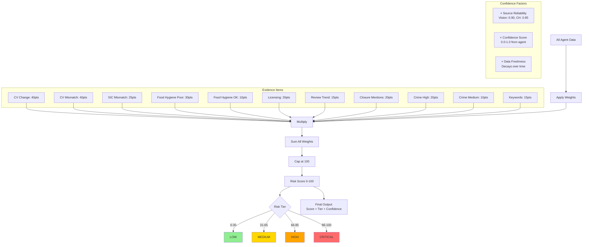

# Risk Scoring Algorithm

How the pipeline calculates risk scores from evidence signals.



## Scoring Formula

```
adjusted_weight = base_weight × confidence × source_reliability × freshness

risk_score = min(Σ(adjusted_weights), 100)
```

## Base Weights

| Signal Type | Weight | Description |
|-------------|--------|-------------|
| **CV Classification Change** | 40 | Occupier type changed from previous |
| **CV Classification Mismatch** | 40 | Vision shows different use than declared |
| **SIC Mismatch** | 25 | Company SIC code doesn't match property class |
| **Food Hygiene Poor** | 30 | Rating 0-2 (indicates business stress) |
| **Food Hygiene OK** | 10 | Rating 3 (acceptable but not good) |
| **Licensing Nearby** | 20 | Alcohol/entertainment licenses in vicinity |
| **Review Negative Trend** | 15 | Sentiment declining over time |
| **Review Closure Mentions** | 20 | Multiple reviews mention closure |
| **Crime Commercial High** | 20 | High commercial burglary rate |
| **Crime Commercial Medium** | 10 | Moderate crime rate |
| **Keyword Hits** | 15 | Risk terms (vape, shisha, etc.) |

## Confidence Multipliers

### Source Reliability
| Source | Reliability | Reason |
|--------|-------------|--------|
| Vision | 0.90 | Good but can hallucinate |
| Companies House | 0.95 | Authoritative government data |
| Food Hygiene | 0.95 | Official inspections |
| Crime | 0.90 | Official police data |
| Licensing | 0.95 | Official license data |
| Reviews | 0.70 | Subjective, can be biased |
| Keywords | 0.75 | Simple text matching |

### Confidence Score
Each agent provides a 0.0-1.0 confidence score:
- Vision: Based on image quality, clarity
- AI agents: Based on model certainty
- Data agents: Based on data quality/freshness

### Data Freshness
Decays over time:
```python
freshness = 0.99 ** days_since_update
```

- Today: 1.0 (100%)
- 30 days ago: 0.74 (74%)
- 90 days ago: 0.40 (40%)

## Risk Tiers

| Tier | Score Range | Color | Action |
|------|-------------|-------|--------|
| **Low** | 0-30 | 🟢 Green | No action needed |
| **Medium** | 31-65 | 🟡 Yellow | Monitor regularly |
| **High** | 66-85 | 🟠 Orange | Needs review |
| **Critical** | 86-100 | 🔴 Red | Urgent attention |

## Example Calculation

```python
# Evidence: CV Mismatch
base_weight = 40
confidence = 0.95  # Vision was very confident
source_reliability = 0.90  # Vision reliability
freshness = 1.0  # Just collected

adjusted = 40 × 0.95 × 0.90 × 1.0 = 34.2 points

# Evidence: Food Hygiene Poor
base_weight = 30
confidence = 1.0  # Official rating
source_reliability = 0.95  # FSA authoritative
freshness = 0.95  # 5 days old

adjusted = 30 × 1.0 × 0.95 × 0.95 = 27.1 points

# Total Score
score = min(34.2 + 27.1, 100) = 61

tier = "medium"  # 31-65 range
```

## Confidence Calculation

```python
# Average confidence across all evidence
overall_confidence = mean(evidence.confidence for evidence in items)

# Boost if multiple high-confidence signals
high_conf_count = sum(1 for e in items if e.confidence >= 0.85)
if high_conf_count >= 2:
    overall_confidence *= 1.1  # 10% boost

overall_confidence = min(overall_confidence, 1.0)  # Cap at 100%
```

## Display Format

```json
{
  "score": 61,
  "tier": "medium",
  "confidence": 0.87,
  "evidence_items": [
    {
      "signal_type": "cv_classification_mismatch",
      "weight": 40,
      "adjusted_weight": 34.2,
      "confidence": 0.95,
      "confidence_factors": {
        "source_reliability": 0.90,
        "vision_confidence": 0.95,
        "data_freshness": 1.0
      }
    }
  ]
}
```
